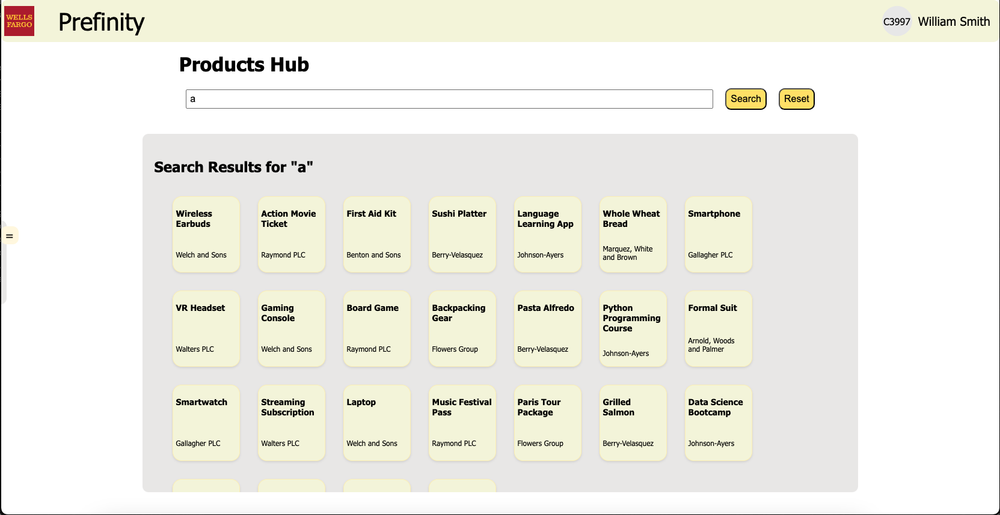

# 🚀 Project Name

## 📌 Table of Contents
- [Introduction](#introduction)
- [Demo](#demo)
- [Inspiration](#inspiration)
- [What It Does](#what-it-does)
- [How We Built It](#how-we-built-it)
- [Challenges We Faced](#challenges-we-faced)
- [How to Run](#how-to-run)
- [Tech Stack](#tech-stack)
- [Team](#team)

---

## 🎯 Introduction
### Project Overview: AI-Powered Hyper-Personalized Recommendations
Our project aims to revolutionize customer engagement by leveraging AI to deliver hyper-personalized recommendations across diverse domains. The core objective is to enhance customer satisfaction and business outcomes by tailoring product, loan, and investment suggestions based on individual preferences, purchase behavior, and sentiment analysis.

### Problem Statement:
The challenge is to build an intelligent system that integrates:

**Product Recommendations**: Using collaborative filtering and sentiment analysis to provide relevant product suggestions.

**Loan Recommendations**: Leveraging machine learning models to suggest the most suitable loan options based on financial profiles.

**Business Insights**: Generating actionable insights for businesses to improve decision-making and customer targeting.

By combining customer similarity, product similarity, and sentiment analysis, the system dynamically adapts to evolving user preferences, ensuring continuous refinement of recommendations

## 🎥 Demo
📹 [Video Demo](./artifacts/demo/demo_video.mp4) 

🖼️ Screenshots:
Login Page:


Products Hub:


Products Search:


MyFin: Financial Hub:


InsightGen: Business Portal:


## 💡 Inspiration
Our inspiration for this project stemmed from recognizing a gap in personalized customer experiences across industries. In today's digital landscape, customers expect tailored recommendations, whether they are shopping for products, exploring financial options, or seeking insights to grow their businesses. However, many existing recommendation systems either:

- Lack contextual understanding of customer behavior.
- Provide generic suggestions that fail to align with individual preferences.
- Miss opportunities to adapt dynamically to changing user needs.


## ⚙️ What It Does
Our AI-powered system delivers hyper-personalized recommendations and business insights by integrating machine learning, sentiment analysis, and collaborative filtering across three major domains—product recommendations, loan suggestions, and business insights. The key features are:

- Personalized Product Recommendations
- AI-Driven Loan Recommendations
- Business Insights Generation
- Secure Authentication and Role-Based Access
- Seamless API and UI Integration

## 🛠️ How We Built It
Our system was developed using a combination of modern technologies, frameworks, and tools to ensure efficiency, scalability, and security.

### Backend and API Development
FastAPI for handling API requests, routing, and middleware.
CORS Middleware for secure cross-origin communication.

### Machine Learning Models
TensorFlow for loading and running the pre-trained loan approval prediction model.
Scikit-learn for computing product and customer similarity using cosine similarity.

### Frontend
The Frontend of the application is written in Typescript and React.js to ensure type safety and produce a modern interface.

## 🚧 Challenges We Faced
During the development of our system, we encountered several technical and non-technical challenges:

- Data Generation and Preparation
- Ensuring Accurate Recommendations
- Integrating Multiple Models Seamlessly
- LLM Integration and Response Optimization
- Authentication and Access Control


## 🏃 How to Run
Setup and Installation Instructions
1. **Clone the Repository**:
   
   Open a terminal and run the command to clone the repository.
   ```sh
   git clone https://github.com/ewfx/aidhp-otaku-coders.git
   ```

2. **Install Required Software**:

   Download and install the following:

   - Python 3.12
   - Latest version of Node.js

3. **Install Required Python Packages**:

   Open a terminal and navigate to the project folder named code.
   Run the command to install the required Python packages from the requirements file.

   ```sh
   pip install -r requirements.txt
   ```

4. **Generate Google API Key**:

   Visit the [Google AI Studio](https://aistudio.google.com/apikey) website and generate an API key.

5. **Set the API Key**:

   After generating the API key, set the environment variable by running the appropriate command:
   - For Windows, use the command to set the API key.
      ```powershell
      $env:GOOGLE_API_KEY = "your_api_key"
      ```
   - For Mac or Linux, use the export command to set the API key.
      ```sh
      export GOOGLE_API_KEY = "your_api_key"
      ```

6. **Start the API**:
   Open a terminal and navigate to the src folder inside the code folder.
   Run the command to start the FastAPI server with Uvicorn.

   ```sh
   cd code/src
   python -m uvicorn main:app --reload
   ```

7. **Install the Packages for UI**:
   Open a new terminal and navigate to code/src/web_app folder.
   Then run the following code.
   ```sh
   cd code/src/web_app
   npm install
   ```

7. **Run the UI**:

   Start the UI by running the following command:
   ```sh
   npm run dev
   ```
   The UI will be available at the address http://localhost:5173/.

## 🏗️ Tech Stack
- 🔹 Frontend: React
- 🔹 Backend: FastAPI
- 🔹 Database: SQLite
- 🔹 Other: Google Gemini API

## 👥 Team
- **Sajal Singhal** - [GitHub](https://github.com/SSReal)
- **Md Ubaid Khan** - [GitHub](https://github.com/mdubaidkhan)
- **Swarnabh Paul** - [Github](https://github.com/SwarnabhGHDummy)